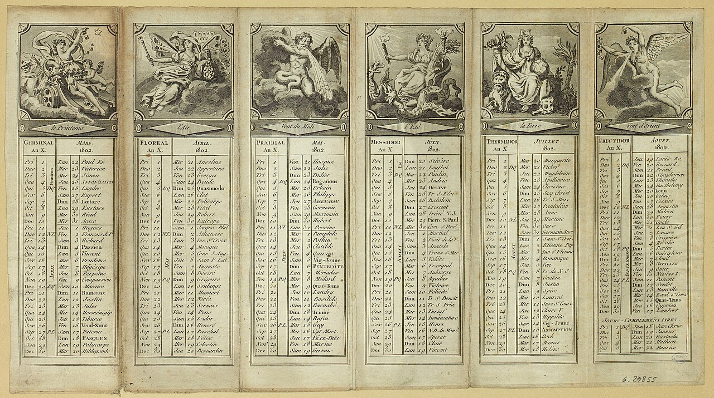
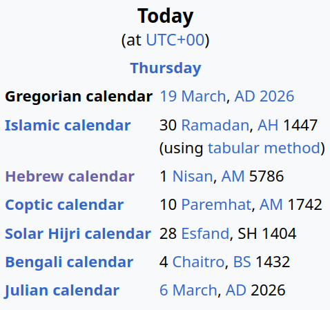

# Le soleil, c'est compliqué

<v-click>
Vraiment très compliqué ...
</v-click>

<v-click>
Vous êtes ready ?
</v-click>

---

# La périodicité naturelle

<ul>
  <li v-click="1">le jour ☀️, la nuit 🌌🌙</li>
  <li v-click="3">les 4 saisons astronomiques : 🌱🌻🍂🪾</li>
  <ul>
    <li v-click="8">les saisons équatoriales: 🌧️☀️</li>
  </ul>
  <li v-click="11">les années 📆</li>
</ul>

---

# Oui, mais ...

<ul>
  <li v-click="1">jour solaire ? civil ?
    <ul>
      <li v-click="3">jour solaire : centré sur midi solaire (zénith)</li>
      <li v-click="4">donc aujourd'hui le 31 mars : 7:32 (UTC) --> 20:18 (ECST)</li>
      <li v-click="5">donc midi solaire à (7:32+20:18)/2 = 13:55 (UTC)</li>
      <li v-click="6">donc midi solaire à pas du tout "midi"</li>
    </ul>
  </li>
  <li v-click="7">année tropicale ? sidérale ? civile ?
    <ul>
      <li v-click="10">tropicale (retour du soleil au même point dans le ciel) : ~365.24219 jours "éphémérides" (2000)</li>
      <li v-click="12">sidérale (retour de la Terre au même point sur son orbite) : 365.256363 jours (2025)</li>
      <li v-click="14">différence de ~20 minutes et 24.7 seconds</li>
      <li v-click="15">anodin ?</li>
    </ul>
  </li>
</ul>

---

# Une histoire de chocolat ?

<v-clicks depth="2">

* Jésus-Christ a ressuscité &#91;citation needed&#93;
  * les chrétiens ont souhaité commérer cette date
  * 1er dimanche après la pleine lune après le 21 Mars (approximation de l'équinoxe de Mars)
  * date mouvante = 😬
* le calendrier Julien supposait qu'une année faisait exactement 365.25 jours
  * année tropicale ≈ 365.2422
  * on se rend compte que les dates dérivent : le 21 Mars ne colle plus à l'équinoxe
  * 1545 : on souhaite revenir aux dates de 325
* calendrier Grégorien !
  * transition : 10 jours sautés d'un coup (4/10/1582 J -> 15/10/1582 G)
  * année = 365.2425
  * année = 365 ou 366 jours ?

</v-clicks>

<!-- TODO(later): animation correspondance des calendriers -->

<!--
je vous passe les controverses sur comment calculer la date, ni les schismes religieux, ...
je ne vous parle pas non plus du calendrier juif, encore utilisé au début de l'ère chrétienne, qui est lunisolaire
-->

---

# Quiz !

<v-click>

1. Règle pour les années bissextiles ❓

</v-click>

<v-clicks>

* divisible par 4
* mais **pas** par 100
* mais quand même par 400

</v-clicks>

<v-click>

2. Pourquoi "bissextile" ❓

</v-click>

<v-clicks>

* car dans le calendrier Julien il s'insérait après le 24 Février
* > ante diem bis sextum Kalendas Martias
* > le sixième jour bis avant les calendes (le premier jour) de mars

</v-clicks>

<v-click>

ℹ️ En anglais : "leap years"

</v-click>

<v-click>

3. Année civile basée sur : tropicale ou sidérale ❓

</v-click>

<v-clicks>

* tropicale
* on aime les équinoxes constants à travers les siècles (?)

</v-clicks>

---

# Problèmes

<ul>
  <li>Non-continuité : DST</li>
  <li>Non-unicité : DST</li>
  <li>Non-monotonicité : DST</li>
  <li>Non-homogénéité : DST</li>
  <li>Non-constance : DST, leap years</li>
</ul>

---

# Les constantes qui ne le sont pas

<v-clicks depth="2" class="tight-list">

* ☪️ Musulman (Hijri) :
  * lunisolaire ("basé sur la lune")
  * la lune n'a pas une période synodique de X jours exactement (~29.53)
  * année de 12 mois lunaires : 354 ou 355 jours
  * (6×29 + 6×30 = 354 ; 5×29 + 7×30 = 355)
  * les saisons tournent sur 33 ans
* ✡️ Juif :
  * mois lunaires "intercalaires" pour approximer l'année tropicale
  * un mois supplémentaire tous les 2 ou 3 ans
  * cycle métonique : 7 mois en 19 ans
* ☦️ Orthodoxe :
  * resté sur le calendrier Julien
  * 13 jours de retard (non-rattrapés par le passage au Grégorien)
  * règle des bisextiles Julien : simplement divisible par 4
* calendriers 🕉️ bouddhiste, 🐉 chinois, 🕉️ hindou, ...

</v-clicks>

<v-click>

Le calendrier ✝️ grégorien est le standard dans l'industrie occidentale.

</v-click>

<!--
TODO(later): avoir la date en calendrier musulman, juif, ...
-->

---

# Problèmes

<ul>
  <li>Non-continuité : DST</li>
  <li>Non-unicité : DST</li>
  <li>Non-monotonicité : DST</li>
  <li>Non-homogénéité : DST, leap years</li>
  <li>Non-constance : DST, leap years</li>
</ul>

---

# Des solutions ?

<v-click>
Symmetry 454
</v-click>

<v-click>

</v-click>

<v-click>
Semaine intercalaire !! 😭
</v-click>

<v-click>

(52 × année + 146) mod 293 < 52 😵

</v-click>

<v-click>

Bien d'autres ... mais impossible de faire parfait.

</v-click>

---

# Pas de pétrole, mais des idées !

<v-click>
Jours épagomènes ("supplémentaires") "sansculottides" tous les ans, et jour "sextile" tous les 6 ou 7 ans.
</v-click>
<v-click>

</v-click>

<!--
jours épagomènes, cf calendrier égyptien antique
-->

---

# Vive la diversité !

<!-- FIXME PTC screenshot https://en.wikipedia.org/wiki/Gregorian_calendar -->
