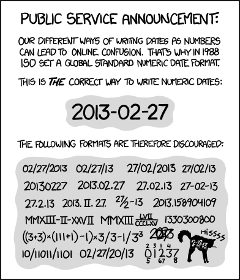
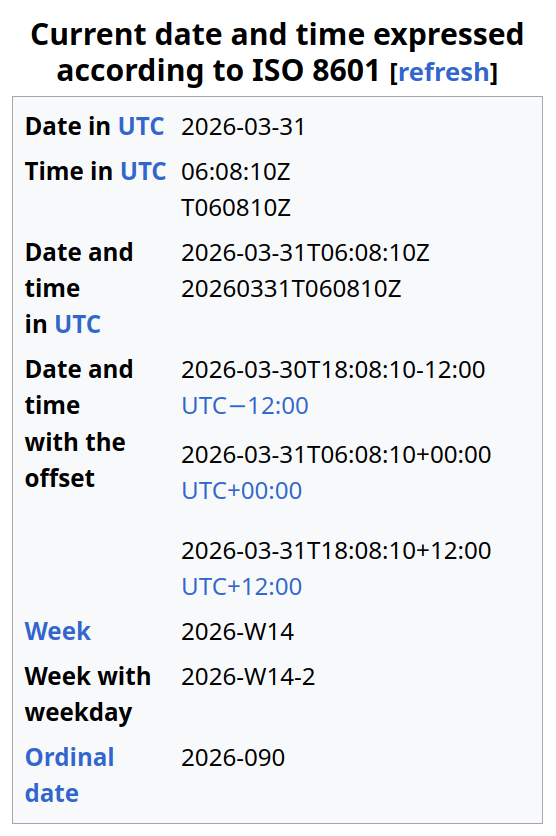

# Quiz !

<v-click>

1. Quel jour et mois désignent `10/11/2025` ❓

</v-click>

<v-clicks class="tight-list">

* 10 novembre (mois n°11), format US `MM-DD-YYYY`
* 11 octobre (mois n°10), format Européen
* aucun moyen de savoir sans contexte

</v-clicks>

<v-click>

2. L'instant <code><LocalTimeOffset :offsetMinutes="-60" /></code> est-il dans le passé ou le futur ❓

</v-click>

<v-clicks class="tight-list">

* dans le passé dans cette salle, car il est <code><LocalTimeOffset/></code>
* dans le futur à Rio de Janeiro, car il est <code><RioClock /></code>
* aucun moyen de savoir sans contexte

</v-clicks>

<v-click>

3. Je dois me lever tôt ou me coucher tard pour une réunion à 9 heures ?

</v-click>

<v-clicks class="tight-list">

* AM = matin ("ante meridiem")
* PM = aprèm ("post meridiem")
* aucun moyen de savoir sans contexte

</v-clicks>

<v-click>

4. Quel jour on sera "le mois prochain" ?

</v-click>

<v-clicks class="tight-list">

* Mercredi 1er ? (premier jour)
* Mardi 28 ? (même jour dans 4 semaines ≈ 1 mois)
* Jeudi 30 ? (même ordinal, ou presque)

</v-clicks>

---

# La joie des standards

  <v-click class="w-1/2">
    
  </v-click>
  <v-click class="w-1/2">
    
  </v-click>

---

# ISO-8601 : pas très accessible

<v-clicks>

* ISO 8601:1988
* ISO 8601:1988/COR 1:1991
* ISO 8601:2000
* ISO 8601:2004
* ISO 8601-1:2019 (basic rules)
* ISO 8601-2:2019 (extensions)
* ISO 8601-1:2019/Amd 1:2022
* ISO 8601-2:2019/Amd 1:2025

</v-clicks>

<v-click>

> Only informative sections of standards are publicly available. To view the full content, you will need to purchase the standard by clicking on the "Buy" button.
> -- [iso.org](https://www.iso.org/obp/ui/#iso:std:iso:8601:-1:ed-1:v1:en)

</v-click>

<v-click>

CHF 181,00 ↔️ EUR 199,15

</v-click>

---

# ISO-8601 : de nombreux concepts

<v-clicks depth="2" class="tight-list">

* années : `YYYY`
  * sachant que l'année `0000` n'existe pas dans le calendrier grégorien
  * `YYY` est autorisé pour désigner une décade, `YY` pour un sicèle
* dates calendaires : `YYYY-MM-DD` ou `YYYY-MM` ou `YYYYMMDD` (et d'autres "disparus")
* semaines de l'année : `YYYY-Www` ou `YYYYWww` (avec `ww` entre `01` et `53`)
  * la première de l'année contient le premier jeudi
  * la semaine 01 de 2027 commencera le 04 janvier
* jours de semaine : `YYYY-Www-D` ou `YYYYWwwD` (avec `D` entre `1` et `7`)
* dates ordinales : `YYY-DDD` ou `YYYDDD` (avec `DDD` entre `001` et `365`/`366`)
* "times" (heures) : `Thh:mm:ss.sss` (ou sans `.sss`, ou sans aucun `:`, ou sans `:ss.sss`, ou `.mmm`, ou ...)
  * tellement de cas !
  * pas de limite au nombre de chiffres pour la partie décimale, "à définir soi-même"
* timezones : `Z` (prononcé "zulu") ou `±hh:mm` (ou sans `:` ou sans `:mm`)
  * mais `-00` est interdit
  * depuis 2019 on peut ajouter `:ss` ou bien `:ss.sss`
* le `T` est obligatoire entre la partie "date" et la partie "time"
* durées : `PnYnMnDTnHnMnS` ou `PnW` ou `P<date>T<time>`
* intervalles : `<start>/<end>` ou `<start>/<duration>` ou `<duration>/<end>` ou juste `<duration>`
* répétitions : `Rn/<interval>` ou `R/<interval>`
* "Extended Date/Time Format" : incertitude, intervalles ouverts, exposants et chiffres significatifs, groupes de mois, dates multiples, ...

</v-clicks>

<v-click>

  

</v-click>

---

# RFC 3339

<v-clicks depth="2">

* "Date and Time on the Internet: Timestamps"
* moins de versions, changements plus mineurs
* définitif depuis 2002
* accessible gratuitement
* censé être un "profil" de l'ISO-8601 (version 1988 et 2000)
* proche, mais différent de ISO-8601 :
  * divergence : timezone `-00` signifie "unknown"
  * divergence : un espace peut séparer la partie "date" de celle "time"
  * obligation : timezone offset
  * obligation : années sur 4 chiffres
* dans les faits, souvent confondus

</v-clicks>

---

# Autres formats "standards"

<v-clicks depth="2">

* ISO/AWI 8601-1 : en cours de développement
* RFC 9557 : en cours de développement
* Unix timestamps : secondes écoulées depuis le 1er Janvier 1970 ("Epoch")
  * <UnixTimestamp />
* Java timestamps : **milli**secondes écoulées depuis l'Epoch Unix
  * <JavaMilliTimestamp />
* RFC (2)822 ("mail date") : format "human-readable"
  * <MailDate />
* RFC 7231 ("http date") : basé sur RFC 2822, mais toujours en GMT
  * <HttpDate />
* CNS 7648 : adaptation taïwanaise d'ISO 8601 au calendrier ROC (Grégorien - 1911)
* ...

</v-clicks>

---

# Problèmes

<ul>
  <li>Non-continuité : DST</li>
  <li>Non-unicité : DST</li>
  <li>Non-monotonicité : DST</li>
  <li>Non-homogénéité : DST, leap years</li>
  <li>Non-constance : DST, leap years</li>
  <li v-click class="text-orange-400">Non-standardized : dates and time formats</li>
</ul>

---

# Le petit détail ...

<v-click>

C'est quoi "GMT" ?

</v-click>
