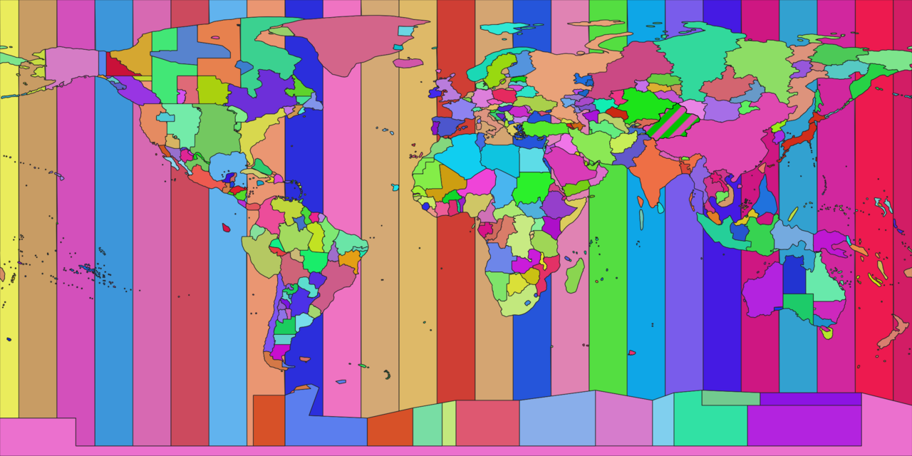
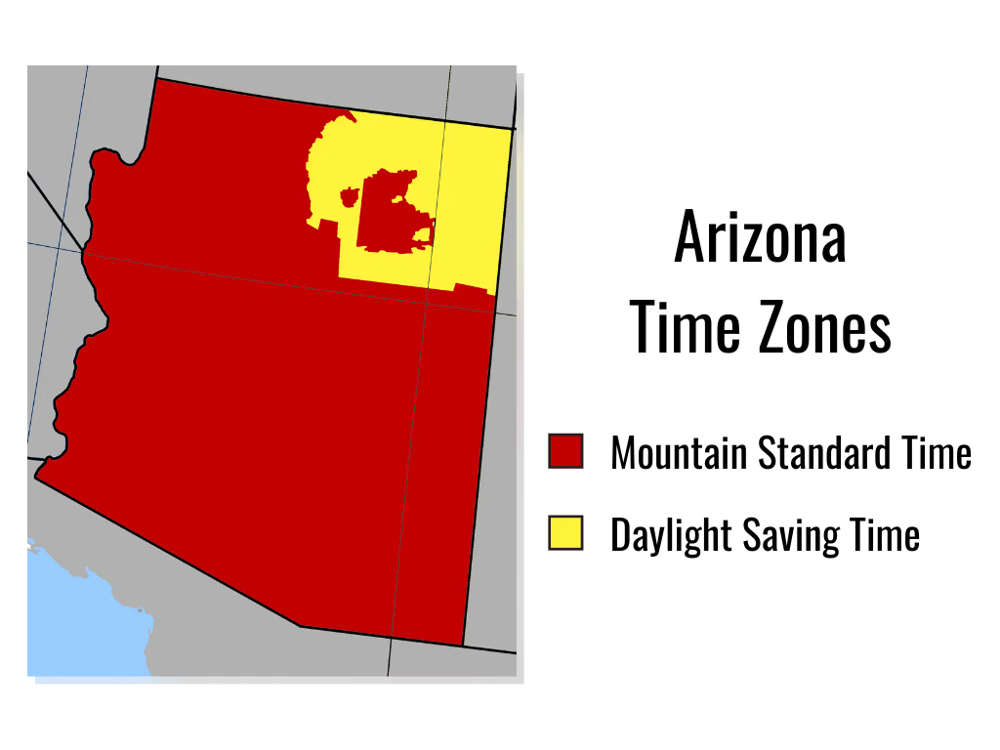
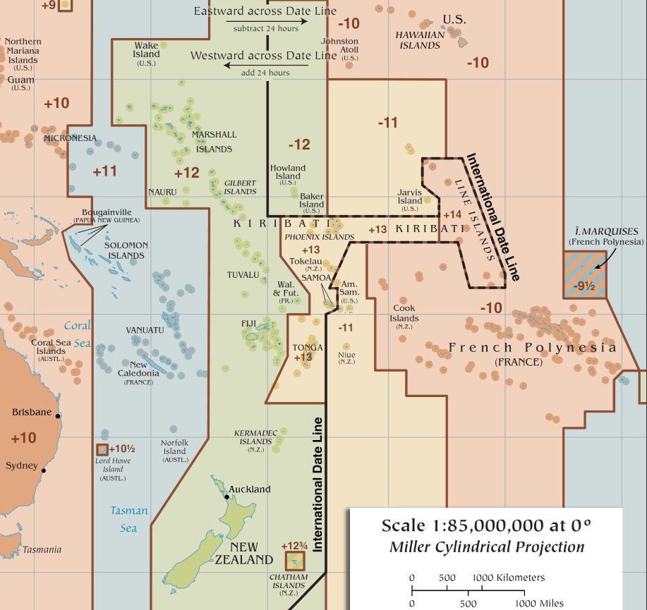
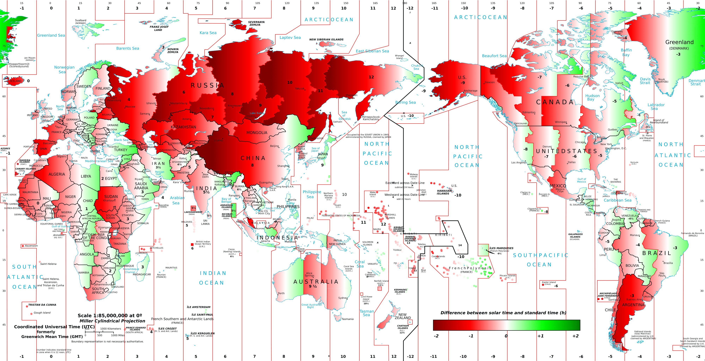

# L'histoire des timezones

<v-click>
Pour faire (très) court :
</v-click>

<v-clicks depth="2">

* avant, le temps était très local
  * on suivait principalement le soleil
  * chaque ville avait son heure
  * on voyageait lentement
* puis les trains ont tout chamboulé
  * (les accidents mortels ont contribué)
* on a décidé d'unifier le temps, progressivement
* (je passe l'histoire chaotique pour chaque pays)
* aujourd'hui, le monde entier est découpé en timezones clairement définies

</v-clicks>

---

---

# Bases et exemples

<v-clicks depth="2" class="tight-list">

* "prime meridian" (IERS Reference Meridian) : Greenwich
  * (je vous passe l'histoire de Greenwich)
  * **a servi à définir UTC**
  * (je vous passe l'histoire d'UTC)
  * UTC = Universel Temps Coordonné / Universal Time Coordinated
* changement d'heure :
  * avant le 29 mars : European Central Time (ECT, UTC+1)
  * après le 29 mars : European Central Summer Time (ECST, UTC+2)
* voyage au Royaume-Uni :
  * UK suit le Greenwich Mean Time (GMT, UTC) ou le British Summer Time (BST, UTC+1)
  * a conservé son changement d'heure synchronisé avec le reste de l'Union Européenne
  * à l'aller je "perds" 1h, au retour je la regagne
* "offset" versus "timezone" :
  * China Standard Time (CST) = `+08:00` ou `Asia/Beijing`
  * Eastern Standard Time (EST) = `-05:00` ou `America/Cancún`
* ni offset ni timezone = "naïve"

</v-clicks>

---

# Un sacré bazar !

<v-clicks depth="2">

* maintenu par l'IANA ("Internet Assigned Numbers Authority", filiale de l'ICANN), aussi connue pour :
  * les DNS root zones
  * les plage d'IP addresses
  * les AS numbers
  * servir de registry pour certains protocoles (port numbers, HTTP status codes, TLS cypher suites, DNS root zones, jeux de caractères pour `Content-Type` UTF-8, ISO-8859-1, ...)
* "IANA Time Zone Database" ou "tz" ou "tzinfo"
  * format riche
  * données historiques
  * mise-à-jour rapide
* inclus dans les OS
* inclus dans les libs des langages de programmation
* à mettre à jour régulièrement

</v-clicks>

---

# Problèmes

<ul>
  <li>Non-continuité : DST</li>
  <li>Non-unicité : DST</li>
  <li>Non-monotonicité : DST</li>
  <li>Non-homogénéité : DST, leap years</li>
  <li>Non-constance : DST, leap years, timezones</li>
  <li>Non-standardized : dates and time formats</li>
</ul>

---

# Un bazar infini !

  
  

<!--
International date line :
* discontinuité de 24 heures (changement de jour)
* demi-heure
* trois-quart d'heure (rare !)
* kiribati -11/-10 devenu +13/+14
-->

---

# Problèmes

<ul>
  <li>Non-continuité : DST, timezones</li>
  <li>Non-unicité : DST, timezones</li>
  <li>Non-monotonicité : DST, timezones</li>
  <li>Non-homogénéité : DST, leap years, timezones</li>
  <li>Non-constance : DST, leap years, timezones</li>
  <li>Non-standardized : dates and time formats</li>
</ul>

---

# Conseils

<v-clicks>

* jamais de datetime naïve
* privilégier UTC autant que possible
* ou sinon, bien savoir ce qu'on fait

</v-clicks>

# Petit bonus : décalage solaire

<v-click>

</v-click>
