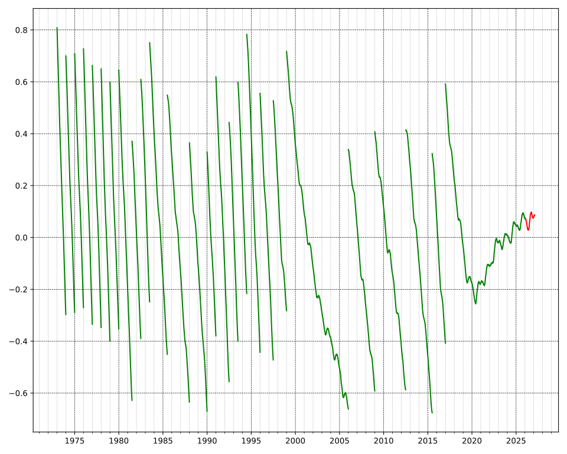

# Sans transition, les secondes !

<v-clicks>

* <LocalTimeOffset />
* rien de plus simple : une toutes les secondes
* wait ...
* la seconde c'est l'unité SI de référence du temps
* > la durée d'un nombre entier d'oscillations (9 192 631 770 exactement) liées à la fréquence de transition hyperfine de l'atome de césium 133
  -- [wikipedia.org](https://fr.wikipedia.org/wiki/Seconde_(temps))
* mesuré à partir d'horloges "atomiques"
* on obtient le TAI : Temps Atomique International
* ➡️ quelle différence avec UTC ? (Universel Temps Coordonné)

</v-clicks>

---

# Le retour de la cosmologie !

<v-clicks>

* il faut d'abord parler de UT(1), et donc de UT0 ...
* à la base il y avait "GMT", différent de "GMT" (UTC+0)
* utilisé par les astronomes : chaque jour va de midi à midi, pour bosser la nuit
* transition à un calendrier minuit-minuit : 
  Midi 31/12/1925 des astronomes devint minuit 31/12/1925
* renommé en UT
* devenu UT0 quand on a introduit UT1
* (UT1 prend en compte une correction du mouvement polaire)
* (je passe sur UT2)
* UT1 sert à calculer UTC

</v-clicks>

---

# Et du coup c'est quoi une seconde UTC ?

<v-clicks>

* une seconde UT1 une fraction (1/86400) de la durée de rotation entre deux zéniths
* mais la Terre n'a pas une rotation constante 
  (forces de marées, convection du noyau, fonte glaciaire, gros séismes)
* donc les secondes UT1 n'ont pas une durée constante par rapport à TAI
* or les secondes UTC sont des secondes TAI
* et UTC doit garantir $|\text{UTC} - \text{UT1}| < 0.9$
* donc c'est le nombre de secondes par jour qui change !
* 86400 ± 1
* seconde intercalaire ! ("leap second")

</v-clicks>

---
clicks: 10
---

# Et comment ça fonctionne ?

<v-click>

 <!-- to to make it a subtitle -->
Ca dépend !

</v-click>

<v-click>

1. Ajout d'une seconde :

<LeapSecondTimelineSVG />

</v-click>

<v-click>

2. Smearing d'une seconde :

<LeapSecondSmearingTimelineSVG />

</v-click>

<v-click>

3. Répétition d'une seconde :

<LeapSecondRepeatTimelineSVG />

</v-click>

---

# Résultat

<v-click>

</v-click>

<v-click>

Bientôt la toute première seconde intercalaire négative ?

</v-click>

<v-click>

Abolition en 2035 ? Offset fixe entre TAI et UTC

</v-click>

---

# Problèmes

<ul>
  <li>Non-continuité : DST, timezones, leap seconds</li>
  <li>Non-unicité : DST, timezones, leap seconds</li>
  <li>Non-monotonicité : DST, timezones, leap seconds</li>
  <li>Non-homogénéité : DST, leap years, timezones, leap seconds</li>
  <li>Non-constance : DST, leap years, timezones, leap seconds</li>
  <li>Non-standardized : dates and time formats, leap seconds</li>
</ul>
