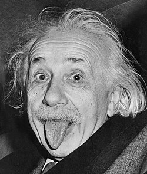

# Comment être toujours à l'heure ?

<v-clicks>

* ~~appeler "l'horloge parlante"~~ (ah non, plus depuis 2022)
* avoir sa propre horloge atomique (💸)
* avoir une montre mécanique ou au quartz
* calendrier solaire
* se brancher à un serveur NTP ("network time protocol") 
  OS, FAI, Français, ...
* se brancher à un serveur PTP ("precise time protocol")
* monter son propre serveur (stratum)
* écouter la fréquence radio adéquate ([SFTS](Standard frequency and time signal service))
* écouter les signaux GPS
* ...

</v-clicks>

---

# Le GPS c'est compliqué !

<v-clicks>

* ce sont des horloges atomiques en orbite autour de la terre
* elles signalent leur position orbitale, et leur "GPS Time" : 
  nombre de secondes atomiques depuis le 6 Janvier, 1980, 00:00:00 UTC
* atomiques et pas UTC, donc il y a un décalage entre les deux !
* et il s'agit de quadrianguler la position du récepteur dans l'espace/temps 😛
* 

</v-clicks>

---

# Tout est relatif !

<v-clicks depth="2">

* la relativité restreinte : référentiels inertiels (sans gravité)
  * espace-temps
  * paradoxe des jumeaux
  * satellites GPS ou ISS
  * Interstellar (spoiler !)
* la relativité générale : référentiels en accélération (gravité)
  * espace-temps courbé
  * lignes droites hyperboliques dans l'espace
  * vitesse constante dans l'espace-temps
  * satellites GPS (45 µs/jour) ou dans l'ISS
  * Interstellar (spoiler !)
* voyage dans le temps :
  * uniquement vers le futur, plus ou moins vite que les autres
  * Oleg Kononenko (1111 jours) : a veilli 0.02+ secondes de moins

</v-clicks>

---

# Problèmes

<ul>
  <li>Non-continuité : DST, timezones, leap seconds</li>
  <li>Non-unicité : DST, timezones, leap seconds</li>
  <li>Non-monotonicité : DST, timezones, leap seconds</li>
  <li>Non-homogénéité : DST, leap years, timezones, leap seconds, general and special relativity</li>
  <li>Non-constance : DST, leap years, timezones, leap seconds</li>
  <li>Non-standardized : dates and time formats</li>
</ul>
