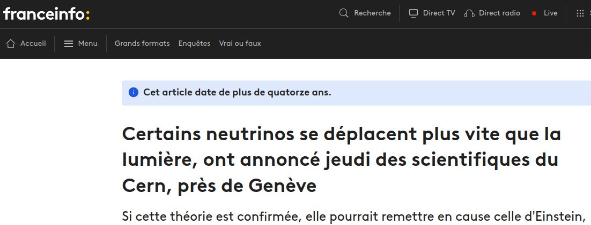
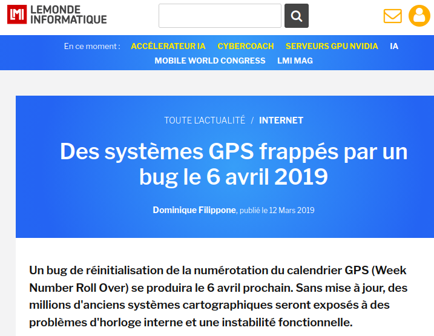
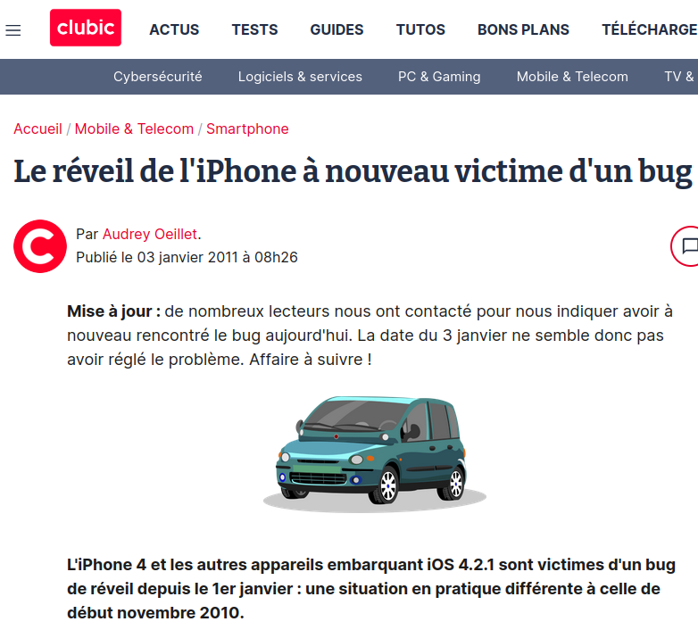
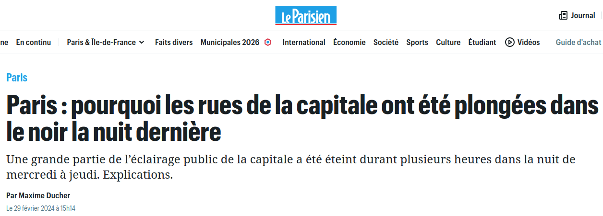
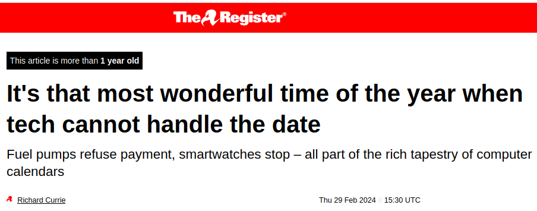
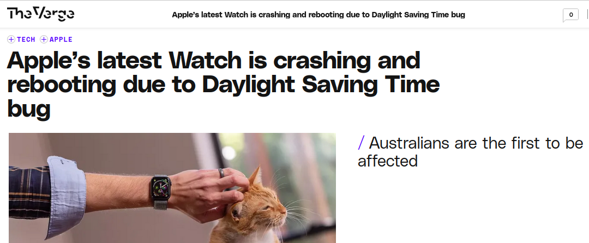
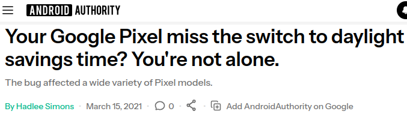
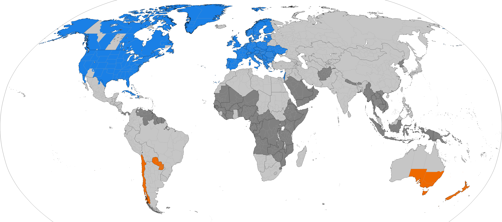
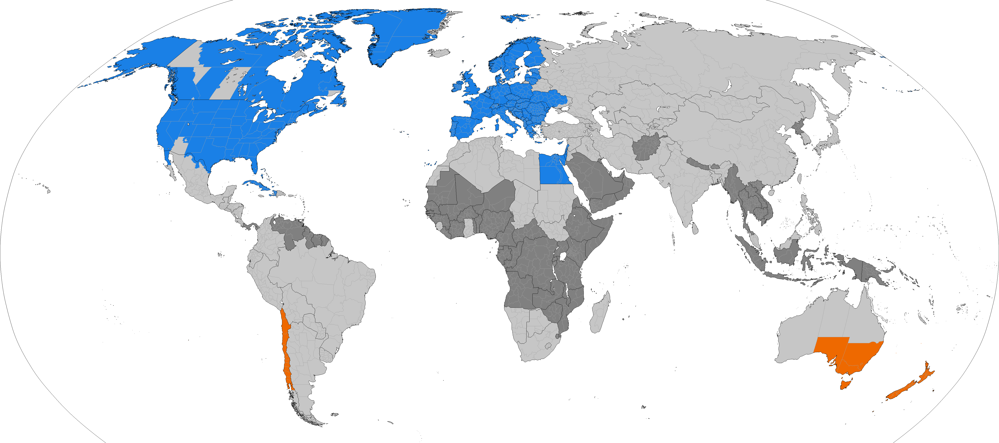
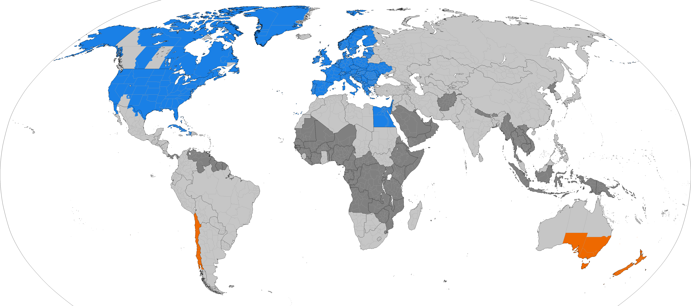

# Le temps c'est de l'argent ...  et des bugs aussi !

---
layout: image
image: ./images/sponsors.png
---

---

## 🚧 Work in progress 🚧

---
layout: two-cols
---

  

::right::

## Qui suis-je ?

<v-click>

**Dev** = j'écris du code

**Software Craft** = apprendre ensemble à faire bien

</v-click>

<v-clicks class="mt-4 text-sm">

- gestion de personnel ferroviaire
- gestion de crise nucléaire
- appareils de mesure électrique
- suivi de travaux BTP
- gestion d'entrepôt logistique
- scanners à bagages aéroportuaires
- bornes de recharge de voiture électrique
- télémétrie de matériel médical
- analyse de trajets de camions routiers
- détection/surveillance de sites de phishing
- ...

</v-clicks>

---

## Le temps

Un problème récurrent :

<v-clicks>

* toujours présent
* intrinsèque à toutes les activités humaines
* crucial dans de nombreux domaines
* si intuitif
* et pourtant si compliqué

</v-clicks>

---

## Définition : le temps

<v-click>

> Milieu indéfini et homogène dans lequel se situent les êtres et les choses et qui est caractérisé par sa double nature, à la fois continuité et succession.
> — [cntrl.fr](https://cnrtl.fr/definition/temps)

</v-click>

<v-click>

> Continuité indéfinie, milieu où se déroule la succession des évènements et des phénomènes, les changements, mouvements, et leur représentation dans la conscience.
> — [dictionnaire.lerobert.com](https://dictionnaire.lerobert.com/definition/temps)

</v-click>

<v-clicks>
🤔
🤨
🧐
🫤
🙄
😒
🤯
😑
🙃
</v-clicks>

<v-click>
Ce qu'en dit la philo :
</v-click>

<v-clicks>

* opérationaliste = c'est ce qu'on mesure, point
* substantialisme absolutiste = c'est compliqué

</v-clicks>

<v-click>
On va se passer de cette définition aujourd'hui ...
</v-click>

---

## Définition : les bugs <v-click>(temporels)</v-click>

  <v-click>
    

      
      <a href="https://www.franceinfo.fr/monde/certains-neutrinos-se-deplacent-plus-vite-que-la-lumiere-ont-annonce-jeudi-des-scientifiques-du-cern-pres-de-geneve_224013.html" class="text-xs text-gray-400 block text-center mt-1">franceinfo.fr</a>
    

  </v-click>
  <v-click>
    

      
      <a href="https://www.lemondeinformatique.fr/actualites/lire-des-systemes-gps-frappes-par-un-bug-le-6-avril-2019-74614.html" class="text-xs text-gray-400 block text-center mt-1">lemondeinformatique.fr</a>
    

  </v-click>
  <v-click>
    

      
      <a href="https://www.clubic.com/smartphone/iphone/actualite-388230-reveil-iphone-victime-bug.html" class="text-xs text-gray-400 block text-center mt-1">clubic.com</a>
    

  </v-click>
  <v-click>
    

      
      <a href="https://www.leparisien.fr/paris-75/paris-pourquoi-les-rues-de-la-capitale-ont-ete-plongees-dans-le-noir-la-nuit-derniere-29-02-2024-H2EHOGKJ2VE5DIU4FZTDMZMDGA.php" class="text-xs text-gray-400 block text-center mt-1">leparisien.fr</a>
    

  </v-click>
  <v-click>
    

      
      <a href="https://www.theregister.com/2024/02/29/fuel_pump_leap_year_bug/" class="text-xs text-gray-400 block text-center mt-1">theregister.com</a>
    

  </v-click>
  <v-click>
    

      
      <a href="https://www.theverge.com/2018/10/8/17950300/apple-watch-series-4-reboot-crash-dst-bug" class="text-xs text-gray-400 block text-center mt-1">theverge.com</a>
    

  </v-click>
  <v-click>
    

      
      <a href="https://www.androidauthority.com/google-pixel-daylight-savings-bug-1208607/" class="text-xs text-gray-400 block text-center mt-1">androidauthority.com</a>
    

  </v-click>

---

# C'est parti pour un voyage ...

A travers le(s) temps !

<Youtube id="PxoKqVwyoOM" width="100%" height="400" />

---

# Une idée de start-up française !

<v-click>
    
</v-click>

---

# Les problèmes commencent ...

<ul>
  <li v-click>Heure de livraison : 02 h 30 (du matin), le Dimanche 29 Mars 2026</li>
  <li v-click>Durée du trajet :
    45 minutes
    = 5" class="text-red-500"> + 1 heure !!!
  </li>
  <li v-click>Heure de départ : 01 h 45</li>
  <li v-click>
    Heure d'arrivée : 03 h 30
    = 5" class="font-mono text-amber-400 ml-2">😰
  </li>
</ul>

<v-click>
Que s'est-il passé ?
</v-click>

<v-click>
Décalage horaire : "daylight saving(s) time"
</v-click>

---
clicks: 3
---

# Décalage horaire

<DSTTimelineSVG />

---

# Problèmes

<ul>
  <li v-click class="text-orange-400">Non-continuité : DST</li>
</ul>

---
clicks: 4
---

# Et dans l'autre sens

<DSTTimelineSVGFall />

---

# Problèmes

<ul>
  <li >Non-continuité : DST</li>
  <li v-click class="text-orange-400">Non-unicité : DST</li>
</ul>

---

# Et encore dans l'autre sens

<v-click>
    
</v-click>

---

# Problèmes

<ul>
  <li>Non-continuité : DST</li>
  <li>Non-unicité : DST</li>
  <li v-click class="text-orange-400">Non-homogénéité : DST</li>
</ul>

---

# Pourquoi s'infliger ça ?

<v-click>
Réponse n°1 : 🛢️ 💲
</v-click>

<v-click>

> Le changement d'heure a été instauré en France à la suite du choc pétrolier de 1973-1974.
> — [service-public.gouv.fr](https://www.service-public.gouv.fr/particuliers/actualites/A18820)

</v-click>

<v-click>
Réponse n°2 : 🌅 ☃️
</v-click>

<v-click>
<WorkAndSchoolSchedule :animated="$clicks >= 6" />
</v-click>

<v-click>
    <SunDuration :x="18" :y="45" :width="28.47" :height="8" label="Solstice d'hiver" color="rgba(147,197,253,0.3)" border="rgba(147,197,253,0.5)" /> <!-- 8h -->
</v-click>
<v-click>
    <SunDuration :x="18" :y="53" :width="45" :height="8" label="Aujourd'hui (31 mars)" color="rgba(134,239,172,0.3)" border="rgba(134,239,172,0.5)" /> <!-- 12h46 -->
</v-click>
<v-click>
    <SunDuration :x="18" :y="61" :width="57" :height="8" label="Solstice d'été" color="rgba(253,224,71,0.3)" border="rgba(253,224,71,0.5)" /> <!-- 16h -->
</v-click>

<!-- 31 mars : lever 7h32 coucher 20h18 -->

---

# Evolutions

  <!-- Images at odd clicks: 1, 3, 5, 7, 9, 11, 13 -->
  
  
  
  
  
  

  <!-- Empty steps at even clicks: 2, 4, 6, 8, 10, 12 — add DraggableAnnotations here -->
  
  <DraggableAnnotation v-click="2" :labelX="10" :labelY="46" :tipX="18.5" :tipY="38.5">2022 : Mexico</DraggableAnnotation>
  
  <DraggableAnnotation v-click="4" :labelX="60" :labelY="51.5" :tipX="57" :tipY="43.5">2023 : Egypt</DraggableAnnotation>
  
  <DraggableAnnotation v-click="6" :labelX="52" :labelY="0" :tipX="45.5" :tipY="9">2023 : Greenland</DraggableAnnotation>
  <DraggableAnnotation v-click="6" :labelX="64.5" :labelY="9.5" :tipX="57.7" :tipY="23.7">2023 : Ukraine</DraggableAnnotation>
  <DraggableAnnotation v-click="6" :labelX="47.5" :labelY="69" :tipX="33.5" :tipY="71.5">2024 : Paraguay</DraggableAnnotation>
  
  <DraggableAnnotation v-click="8" :labelX="46.5" :labelY="78.5" :tipX="30.5" :tipY="86.5">2025 : Chile</DraggableAnnotation>
  
  <DraggableAnnotation v-click="10" :labelX="19" :labelY="4" :tipX="19" :tipY="17">2026 : British Columbia</DraggableAnnotation>
  

---

# Problèmes

<ul>
  <li>Non-continuité : DST</li>
  <li>Non-unicité : DST</li>
  <li>Non-homogénéité : DST</li>
  <li v-click class="text-orange-400">Non-constance : DST</li>
</ul>

---

# Avez-vous remarqué ?

<SunDuration :x="18" :y="25" :width="28.47" :height="8" label="Solstice d'hiver" color="rgba(147,197,253,0.3)" border="rgba(147,197,253,0.5)" /> <!-- 8h -->
<SunDuration :x="18" :y="33" :width="45" :height="8" label="Aujourd'hui (31 mars)" color="rgba(134,239,172,0.3)" border="rgba(134,239,172,0.5)" /> <!-- 12h46 -->
<SunDuration :x="18" :y="41" :width="57" :height="8" label="Solstice d'été" color="rgba(253,224,71,0.3)" border="rgba(253,224,71,0.5)" /> <!-- 16h -->

<!-- pas la même durée -->

---

# Le soleil, c'est compliqué

<v-click>
Vraiment très compliqué ...
</v-click>

<v-click>
Vous êtes ready ?
</v-click>

---

# La périodicité naturelle

<ul>
  <li v-click="1">le jour ☀️, la nuit 🌌🌙</li>
  <li v-click="3">les saisons : 🌱🌻🍂🪾</li>
  <li v-click="8">les années 📆</li>
</ul>

---

# Oui, mais ...

<ul>
  <li v-click="1">jour solaire ? ou jour civil ?
    <ul>
      <li v-click="3">jour solaire : centré sur midi solaire (zénith)</li>
      <li v-click="4">donc aujourd'hui le 31 mars : 7:32 (UTC) --> 20:18 (ECST)</li>
      <li v-click="5">donc midi solaire à (7:32+20h18)/2 = 13h55 (UTC)</li>
      <li v-click="6">donc midi solaire à pas du tout "midi"</li>
    </ul>
  </li>
  <li v-click="7">saison biologique ? climatique ? calendaire ?
    <ul>
      <li v-click="8">"printemps/été" commence en septembre/Octobre, et "dure environ six mois" = (source: <a href="https://www.beadesigner.it/fr/blog-4/les-saisons-de-la-mode-lors-du-lancement-de-votre-collection/">beadesigner.it)</a></li>
      <li v-click="9">"super-été" (changement climatique) : date de l'été inchangée, caractéristiques différentes</li>
    </ul>
  </li>
  <li v-click="10">année celeste ? tropicale ? 
  TODO
  </li>
</ul>

---

# Timeline Component Demo

<Timeline name="Seconds" unit="s" :start="58" :count="5" :highlights="[60]" :chunks="[[58,59], [60], [61,62]]" />

<Timeline name="Minutes" unit="m" :start="0" :count="5" :highlights="[1]" :chunks="[[0], [1], [2,3,4]]" />

<Timeline name="Hours" unit="h" :start="23" :count="4" :highlights="[0]" :chunks="[[23], [0], [1,2]]" />

---

# Leap Second Bug Demonstration

<TimelineBifurcating
  :main="{
    name: 'RFC-compliant system',
    unit: 's',
    start: 58,
    values: [58, 59, 60, 0, 1, 2],
    highlights: [60]
  }"
  :branches="[
    {
      name: 'System with leap second bug',
      splitAt: 60,
      values: [0, 1, 2, 3],
      highlights: [0]
    }
  ]"
  :chunks="[
    { reveals: [{ timeline: 'main', values: [58] }] },
    { reveals: [{ timeline: 'main', values: [59] }] },
    {
      reveals: [
        { timeline: 'main', values: [60] },  // Main shows 60
        { timeline: 0, values: [0] }          // Branch shows 0
      ]
    },
    {
      reveals: [
        { timeline: 'main', values: [0] },
        { timeline: 0, values: [1] }
      ]
    },
    {
      reveals: [
        { timeline: 'main', values: [1] },
        { timeline: 0, values: [2] }
      ]
    },
    {
      reveals: [
        { timeline: 'main', values: [2] },
        { timeline: 0, values: [3] }
      ]
    }
  ]"
/>

<v-click at="3">

**Bug:** System skips leap second (60s), jumping directly from 59s to 00s

</v-click>

---

# Remerciements

* Claude
* Slidev.js

---

# Crédits photo

* Photo of a croissant by <a href="https://unsplash.com/@personal_graphic?utm_source=unsplash&utm_medium=referral&utm_content=creditCopyText">personalgraphic.com</a> on <a href="https://unsplash.com/photos/a-croissant-sitting-on-top-of-a-white-surface-VzUE5RtCuBA?utm_source=unsplash&utm_medium=referral&utm_content=creditCopyText">Unsplash</a>
* Images des évolutions des DST par Wikipedia : [DST_Countries_Map.png](https://en.wikipedia.org/w/index.php?title=File:DST_Countries_Map.png&offset=&limit=500)

# Ressources pour aller + loin

* [Launch Pad Astronomy - The Sky Part 1: Local Sky and Alt-Az / Horizon Coordinates](https://www.youtube.com/watch?v=i2e0aRtwsCY) : explication des coordonnées célestes Altitude-Azimuth + très jolie visualisation des mouvements célestes en 2nde partie
* [qntm - So You Want To Abolish Time Zones](https://qntm.org/abolish) : courte fiction sur les problèmes introduits par l'abolition des timezones
* [qntm - So You Want Continuous Time Zones](https://qntm.org/continuous) : courte fiction sur les problèmes causés par la multiplication des timezones
* Noël en Australie, © [myflag.com.au](https://myflag.com.au/product/aussie-christmas-flag-150-x-90cm/)
