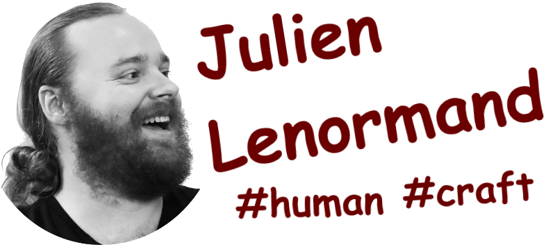

# Le temps c'est de l'argent ...  et des bugs aussi !

---
layout: image
image: ./images/sponsors.png
---

---

## 🚧 Work in progress 🚧

---
layout: two-cols
---

  

::right::

## Qui suis-je ?

<v-click>

**Dev** = j'écris du code

**Software Craft** = apprendre ensemble à faire bien

</v-click>

<v-clicks class="mt-4 text-sm">

- gestion de personnel ferroviaire
- gestion de crise nucléaire
- appareils de mesure électrique
- suivi de travaux BTP
- gestion d'entrepôt logistique
- scanners à bagages aéroportuaires
- bornes de recharge de voiture électrique
- télémétrie de matériel médical
- analyse de trajets de camions routiers
- détection/surveillance de sites de phishing
- ...

</v-clicks>

---

## Le temps

Un problème récurrent :

<v-clicks>

* toujours présent
* intrinsèque à toutes les activités humaines
* crucial dans de nombreux domaines
* si intuitif
* et pourtant si compliqué

</v-clicks>

---

## Définition : le temps

<v-click>

> Milieu indéfini et homogène dans lequel se situent les êtres et les choses et qui est caractérisé par sa double nature, à la fois continuité et succession.
> — [cntrl.fr](https://cnrtl.fr/definition/temps)

</v-click>

<v-click>

> Continuité indéfinie, milieu où se déroule la succession des évènements et des phénomènes, les changements, mouvements, et leur représentation dans la conscience.
> — [dictionnaire.lerobert.com](https://dictionnaire.lerobert.com/definition/temps)

</v-click>

<v-clicks>
🤔
🤨
🧐
🫤
🙄
😒
🤯
😑
🙃
</v-clicks>

Ce qu'en dit la philo :

* opérationaliste = c'est ce qu'on mesure, point
* substantialisme absolutiste = c'est compliqué

On va se passer de cette définition aujourd'hui ...

---

## Définition : les bugs <v-click>(temporels)</v-click>

* 

---

# Timeline Component Demo

<Timeline name="Seconds" unit="s" :start="58" :count="5" :highlights="[60]" :chunks="[[58,59], [60], [61,62]]" />

<Timeline name="Minutes" unit="m" :start="0" :count="5" :highlights="[1]" :chunks="[[0], [1], [2,3,4]]" />

<Timeline name="Hours" unit="h" :start="23" :count="4" :highlights="[0]" :chunks="[[23], [0], [1,2]]" />

---

# Leap Second Bug Demonstration

<TimelineBifurcating
  :main="{
    name: 'RFC-compliant system',
    unit: 's',
    start: 58,
    values: [58, 59, 60, 0, 1, 2],
    highlights: [60]
  }"
  :branches="[
    {
      name: 'System with leap second bug',
      splitAt: 60,
      values: [0, 1, 2, 3],
      highlights: [0]
    }
  ]"
  :chunks="[
    { reveals: [{ timeline: 'main', values: [58] }] },
    { reveals: [{ timeline: 'main', values: [59] }] },
    {
      reveals: [
        { timeline: 'main', values: [60] },  // Main shows 60
        { timeline: 0, values: [0] }          // Branch shows 0
      ]
    },
    {
      reveals: [
        { timeline: 'main', values: [0] },
        { timeline: 0, values: [1] }
      ]
    },
    {
      reveals: [
        { timeline: 'main', values: [1] },
        { timeline: 0, values: [2] }
      ]
    },
    {
      reveals: [
        { timeline: 'main', values: [2] },
        { timeline: 0, values: [3] }
      ]
    }
  ]"
/>

<v-click at="3">

**Bug:** System skips leap second (60s), jumping directly from 59s to 00s

</v-click>
